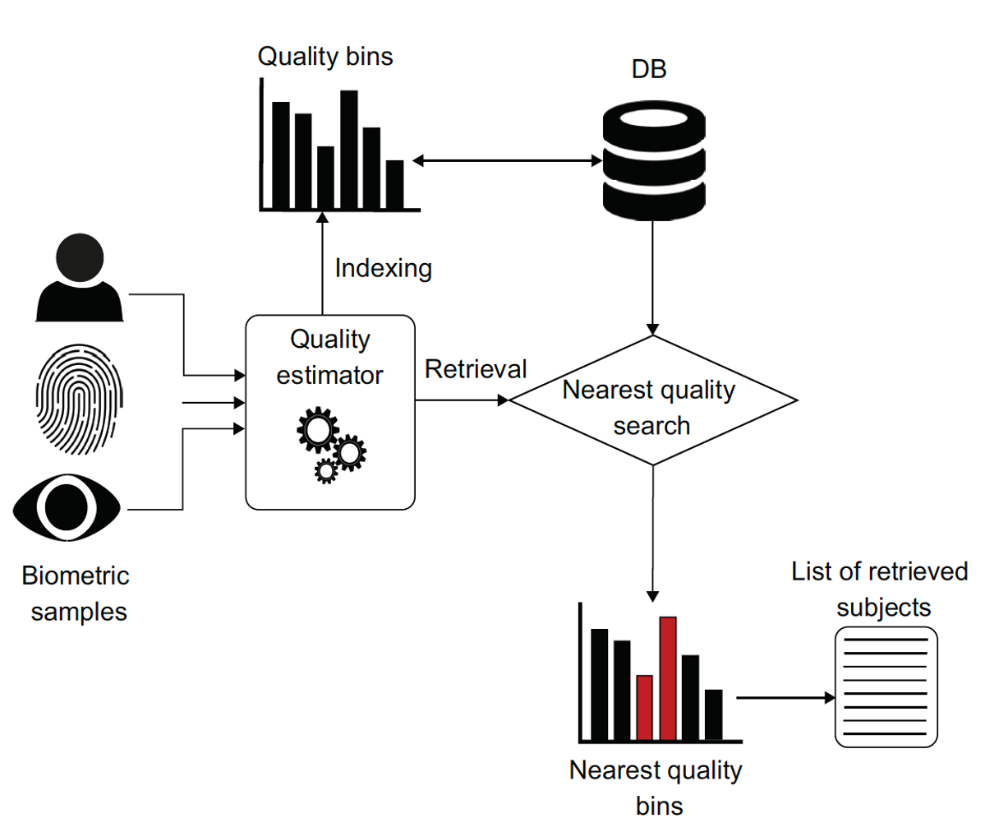
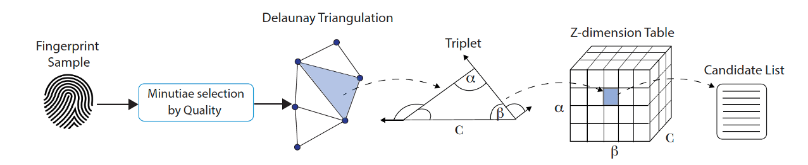
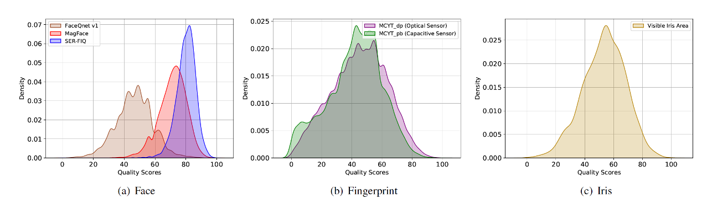
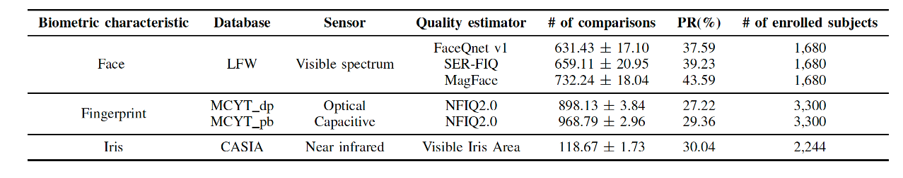
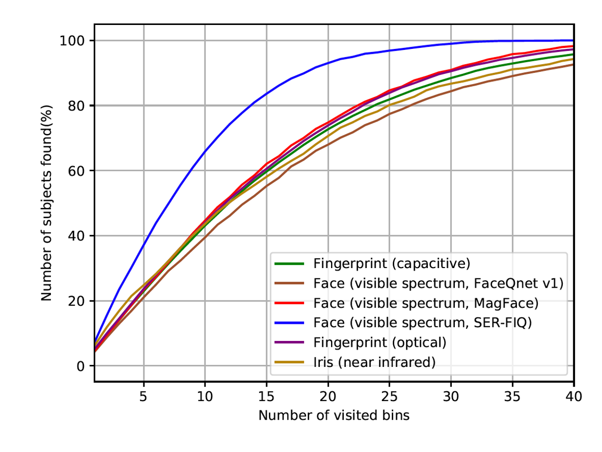
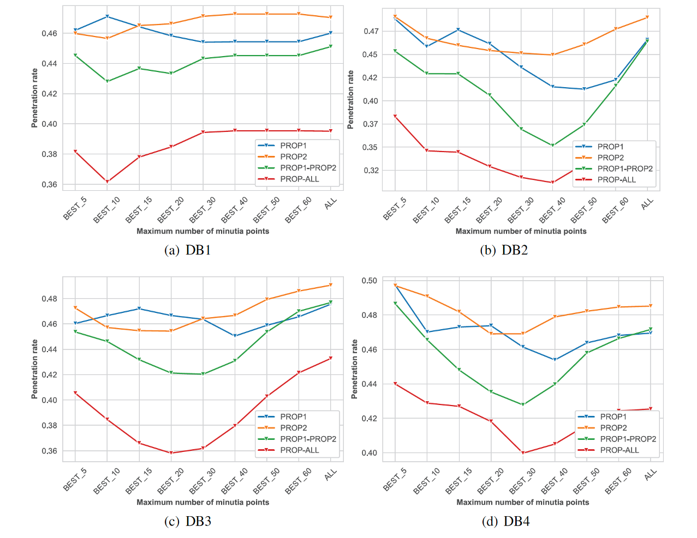

# quality-filtering

Refactored code used in the paper "Exploring Quality Scores for Workload Reduction in Biometric Identification" (IWBF 2022, Osorio-Roig et al. (https://ieeexplore.ieee.org/abstract/document/9794533)). A summary of the paper can be found at the end of this README.

Refactored code used also in the paper "Analysis of Minutiae Quality for Improved Workload Reduction in Fingerprint Identification" (BIOSIG 2022, Osorio-Roig et al. (https://ieeexplore.ieee.org/abstract/document/9897018)). A summary of the paper can be found at the end of this README.

### Quality filtering from different sources 



# Abstract and Contribution

In this work, we investigate whether the quality scores resulting from different sample quality assessment methods can be suitable for computational workload reduction (indexing). We propose a nearest quality score-based intelligent search for indexing in biometric identification. The experimental evaluation
is conducted on databases of three biometric characteristics, i.e. face, iris, and fingerprint. Experimental results report a significant computational workload reduction with respect to the exhaustive search scenario – down to 38%, 29%, and 31% over face, fingerprint, and iris, respectively.

### Quality filtering from a single source



# Abstract and Contribution

The workload of biometric identification in large fingerprint databases poses a challenging
problem. Efficient schemes for biometric workload reduction are a topic of ongoing research.
Some of the state-of-the art approaches rely on triangles of minutia points generated by Delaunay
triangulation, which are then used for indexing. In this paper, we investigate how quality estimation
at the minutia level can improve the performance of such algorithms and hence the system workload.
In order to reduce the number of spurious and missing minutiae, we analyse the impact of selecting
minutiae points based on their qualities. This, in turn, can significantly distort the triangulation. In
addition, we consider the usefulness of the average minutia quality as an additional criteria of the
minutia triangles for indexing. Our results show that both strategies lead to a significant reduction
in biometric workload compared to a baseline solution (i.e. exhaustive search) – down to 36% on
average.

# Citation

If you use this code in your research, please cite the following papers:

```{bibtex}

@inproceedings{OsorioRoig-QualityScoresIndexing-IWBF-2022,
 Author = {D. Osorio-Roig and T. Schlett and C. Rathgeb and J. Tapia and C. Busch},
 Booktitle = {Proc. Intl. Workshop on Biometrics and Forensics ({IWBF})},
 File = {:https\://cased-dms.fbi.h-da.de/literature/OsorioRoig-QualityScoresIndexing-IWBF-2022.pdf:URL},
 Groups = {TReSPAsS-ETN, ATHENE},
 Keywords = {Workload Reduction, Face, Iris, Fingerprint, Sample Quality, Biometric Indexing},
 Month = {April},
 Title = {Exploring Quality Scores for Workload Reduction in Biometric Identification},
 Year = {2022}
}
```

```{bibtex}

@inproceedings{OsorioRoig-IndexingMinutiaeQualityFingerprint-BIOSIG-2022,
 Author = {D. Osorio-Roig and T. Rohwedder and C. Rathgeb and C. Busch},
 Booktitle = {Proc. Intl. Conf. of the Biometrics Special Interest Group ({BIOSIG})},
 File = {:https\://cased-dms.fbi.h-da.de/literature/OsorioRoig-IndexingMinutiaeQualityFingerprint-BIOSIG-2022.pdf:URL},
 Groups = {default},
 Keywords = {Indexing, Workload Reduction, Fingerprint},
 Pages = {1--11},
 Title = {Analysis of Minutiae Quality for Improved Workload Reduction in Fingerprint Identification},
 Year = {2022}
}

```

# Installation on quality filtering from different sources 

- Download Databases used on the paper

- ```install``` [SER-FIQ](https://arxiv.org/abs/2003.09373), [FaceQnetv1](https://arxiv.org/abs/2006.03298), [MagFace](https://arxiv.org/abs/2103.06627), [NFIQ2.0](https://www.nist.gov/services-resources/software/nfiq-2)

- Compute quality information for each source

- Apply normalization step (```min-max```) across the quality values, pre-defined range [0,100]

- Apply ```enrolment``` and ```retrieval``` following the [main-functions] for each source [quality-filtering-face](filtering-different-sources/statistics_face.py), [quality-filtering-finger](filtering-different-sources/statistics_fingerDP.py), and [quality-filtering-iris](filtering-different-sources/statistics_Iris.py)

Project Organization on quality filtering from different sources 
------------

    ├── LICENSE
    ├── README.md                 <- The top-level README for developers using this project.
    ├── images                    <- Figures for the README   
    ├── filtering-different-sources <- Quality filtering from different sources.
        ├── enrolment               <- Prepare system for filtering
            ├── ...                 <- Define type of Quality and source
            ├── IrisQualitySystem   <- Quality defined on Iris-based source
        ├── quality_info            <- Files with quality numerical information  
        ├── statistics_face         <- Define the main of the quality filtering on face
        ├── statistics_fingerDP     <- Define the main of the quality filtering on fingerprint
        ├── statistics_Iris         <- Define the main of the quality filtering on iris

# Description of parameters

- '-e', '--embeddings', help='path to the face embeddings extracted'
- '-o', '--output', help= 'path to save the results'
- '-m', '--model', help= 'path where are the files with the quality information'
- '-n', '--name', help= 'name of the quality estimator used: e.g. [MagFace] or e.g. [SER-FIQ] '
- '-s', '--samples', help= 'number of samples to select per subject'


# Installation on quality filtering from single source
- The code consists partly of Python and partly of C++ code.

- The required packages to execute the Python scripts are detailed in `requirements.txt`. Make sure you have installed Python 3 on your system and execute the shell command
```
python -m pip install -r requirements.txt
```
in the root folder of this repository.

- In order to build the C++ library you need to install CMake (https://cmake.org) and  OpenCV (https://opencv.org/releases/) on your system. Generate your project with CMake using the provided `CMakeLists.txt`.

- The build instructions depend heavily on your operating system, cpu architecture and choice of compiler / linker.

- Extract quality information with [MiDeCon](https://publica.fraunhofer.de/entities/publication/bb011fd0-60ee-4438-86a0-fdf019082ff4/details) through [quality_score_calculation](filtering-single-source/python_scripts/quality_score_calculation.py)


Project Organization on quality filtering from a single source
------------


    ├── LICENSE
    ├── README.md                 <- The top-level README for developers using this project.
    ├── images                    <- Figures for the README   
    ├── filtering-single-source   <- Quality filtering from single source.
        ├── CMakeLists.txt        <- Build Code in C++
        ├── benchmark_results     <- Results on minutia selection modes and hashing modes
        ├── libs                  <- Submodules
            ├── FingerprintImageQuality <- Patched [MiDeCon] implementation 
            ├── pybind11                <- Create a Python interface for the C++ library
        ├── plots                       <- Results plots
        ├── python_scripts              <- Functions for conversion
           ├── ...                      <- Conversion
           ├── benchmark_delaunay_index <- Mapping configurations
        ├── src                         <-  Quality Filtering System


### Experiments

#### Distribution of normalised quality scores from different quality estimators over face, fingerprint, and iris (i.e. different sources).



- High variation can be observed on the Face-based source contributing to the high intra-class variation.

#### Average number of comparisons across different quality estimators



- Results are shown with a 95% of confidence interval.

- Best results (PR <31%) are achieved on fingerprint (for both capture devices) and iris with a low variability in terms of the number of comparisons (σ < 4 and σ < 2 over fingerprint and iris respectively).

#### Relation between the number of visited bins and the percentage of subjects found for a set of transactions for each source



- [SER-FIQ](https://openaccess.thecvf.com/content_CVPR_2020/papers/Terhorst_SER-FIQ_Unsupervised_Estimation_of_Face_Image_Quality_Based_on_Stochastic_CVPR_2020_paper.pdf) as quality estimator seems to outperform the other approaches.

- The earliest chance to find a match in a low number of bins, is depending on the variability in terms of sample quality.

#### Effect of the optimal number of minutiae ranked by its minutiae quality (single source) providing different types of sensor



- [MiDeCon](https://publica.fraunhofer.de/entities/publication/bb011fd0-60ee-4438-86a0-fdf019082ff4/details) as unique quality estimator is used on Fingerprint-based source.

- The selection of the minutiae points corresponding to their ranked qualities has a significant impact on the system workload reduction by reducing the workload baseline (PR<50%).

- It should be considered that any minutiae search process takes less consuming time over a reduced subset of minutiae than on the full set (i.e. “ALL”).